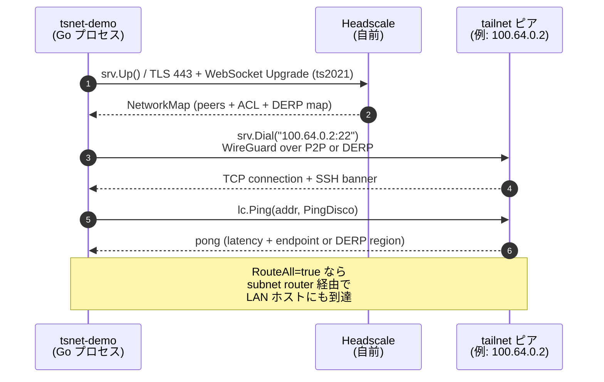
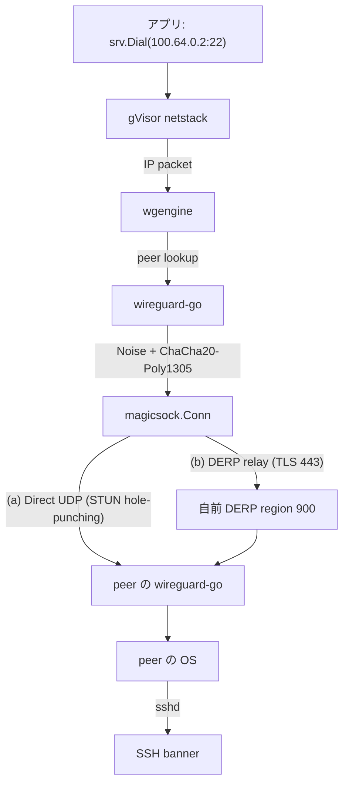

# tsnet-demo

> `tsnet` を使って自前 **Headscale** の tailnet に参加し、 ピアへの Tailscale 内部 Ping と TCP Dial を実機検証する最小サンプル。

[](https://pkg.go.dev/tailscale.com/tsnet)
[](LICENSE)


## 概要

[`tailscale.com/tsnet`](https://pkg.go.dev/tailscale.com/tsnet) を使って Go プログラム自身を **tailnet ノード化** し、 自前 Headscale 経由でピアに Ping / TCP Dial を行う最小サンプル。 「tsnet がちゃんと動くか」 「自前 Headscale + DERP の経路がどう確立するか」 を実機検証するためのテストツールとして使える。

| 検証できること | 出力例 |
|---|---|
| tailnet 参加 (自前 Headscale 認証) | `OK joined tailnet as tsnet-demo [100.64.0.X]` |
| ピア一覧の受信 (NetworkMap 配布) | `Peer: online vpnsv [100.64.0.2 ...]` |
| TCP 接続 (任意ポートへの透過 dial) | `OK connected to 100.64.0.2:22` + SSH バナー |
| Tailscale Ping (経路 / 自前 DERP / ICMP) | `latency=24.3ms, derp=nogulab` |
| Subnet route 経由で LAN ホスト到達 | `Pinging 192.168.X.X (mode=icmp)` |

## アーキテクチャ

### 全体構成 (ASCII)

```
[実行マシン]                                  [自前 tailnet]                    [subnet router の先の LAN]

 ┌─────────────────┐
 │ tsnet-demo      │
 │ (Go バイナリ)    │
 │                 │   参加 + NetworkMap
 │  tsnet.Server   │◄──────────────────────► 自前 Headscale
 │                 │   TLS 443 + WebSocket
 │  100.64.0.X     │   (ts2021)
 └────────┬────────┘
          │ Ping / Dial
          ▼
       [ピア 100.64.0.2] ─── subnet router (--accept-routes) ──► LAN ホスト
                                                                  ICMP / TCP
```

### 通信シーケンス (Mermaid)



### 内部スタック (Mermaid フロー)



## 前提

- Go 1.21+
- 自前 [Headscale](https://github.com/juanfont/headscale) が稼働中 (v0.28+ 推奨)、 HTTPS で到達可能
- tailnet 内にピアが 1 台以上存在 (別の Tailscale クライアント / `tailscaled` など)

## クイックスタート

### 1. ビルド

```bash
git clone https://github.com/NOGUD626/tsnet-demo.git
cd tsnet-demo
go mod tidy
go build -o tsnet-demo .
```

### 2. Headscale で事前認証キーを発行

```bash
ssh <HEADSCALE_HOST> 'sudo headscale preauthkey create -u <USER_ID> -e 1h --reusable'
# → "hskey-auth-XXXXXXXX..." を取得
```

### 3. 実行

```bash
export TS_AUTHKEY=hskey-auth-XXXXXXXX...
./tsnet-demo \
    -control-url https://headscale.example.com \
    -target 100.64.0.2
```

初回起動で `./tsnet-state/` が作成され、 そこに鍵が永続化されるので **2 回目以降は `TS_AUTHKEY` 不要**。

## 使い方 (フラグ一覧)

```text
Usage of ./tsnet-demo:
  -hostname string
        tailnet 上で表示されるホスト名 (default "tsnet-demo")
  -control-url string
        Headscale の URL (default "https://headscale.example.com")
  -target string
        Ping / Dial 先の IP (default "100.64.0.2")
  -port string
        Dial 先の TCP ポート (default "22")
  -state-dir string
        tsnet の state 保存ディレクトリ (default "./tsnet-state")
  -ping-mode string
        ping モード: disco | icmp | tsmp (default "disco")
  -accept-routes
        subnet router の advertised routes を受信する (LAN ホスト到達用)
  -skip-dial
        TCP Dial をスキップ (ping だけ試したいとき)
  -v    tsnet の詳細ログを表示
```

## 例

### tailnet 内のピアに SSH ポートを叩く + disco ping (デフォルト経路情報)

```bash
./tsnet-demo -target 100.64.0.2 -port 22
```

### LAN ホストに ICMP ping (subnet router 経由)

```bash
./tsnet-demo \
    -ping-mode icmp \
    -accept-routes \
    -target 192.168.X.X \
    -skip-dial
```

### 経路を確認したい (P2P 直結 / DERP 経由 のどちらか)

```bash
./tsnet-demo -ping-mode disco -target 100.64.0.2 -skip-dial
# → "endpoint=..." が出れば P2P 直結、 "derp=..." なら DERP 経由
```

## Ping モードの違い

| mode | 内容 | 用途 |
|---|---|---|
| `disco` (default) | Tailscale 独自の disco プロトコル | **経路情報** (P2P / DERP) が分かる。 相手 OS には届かない |
| `icmp` | 本物の ICMP echo を tailnet トンネル経由で送信 | **死活確認**。 相手 OS が応答する (subnet route 経由でも OK) |
| `tsmp` | Tailscale Mesh Protocol | (内部用途) |

## 内部で何が起きているか

```
[ユーザーコード]                [Headscale]
  srv.Up()  ─── 認証 ────────► (gRPC / WebSocket Upgrade over TLS 443)
                          ◄── NetworkMap (ピア一覧 + ACL + DERP マップ)

  srv.Dial("100.64.0.2:22")
       │
       ▼
  [gVisor netstack] → [wgengine] → [wireguard-go (Noise + ChaCha20)]
                                          │
                                          ▼
                                  [magicsock]
                                  ├─ Direct UDP (P2P, STUN で hole-punching)
                                  └─ DERP リレー (TLS 443) ← フォールバック
```

## トラブルシューティング

| 症状 | 対処 |
|---|---|
| `tsnet up failed: 401 Unauthorized` | AuthKey が期限切れ or 既に使用済。 新規発行 (`headscale preauthkey create -u <ID> -e 1h --reusable`) |
| `tsnet up failed: tls handshake failed` | Headscale 側の TLS 証明書 / リバースプロキシ設定を確認 |
| `Ping failed: context deadline exceeded` | magicsock が warm up していない。 先に `srv.Dial` するか、 リトライ間隔を伸ばす |
| LAN ホストに到達できない (`i/o timeout`) | `-accept-routes` を付ける ([Issue #8897](https://github.com/tailscale/tailscale/issues/8897)) |
| 2 回目に hostname 重複エラー | `headscale nodes delete -i <ID>` で旧ノード削除 or `-state-dir` を変える |

## 片付け

```bash
# 1. ローカル state を削除
rm -rf ./tsnet-state

# 2. Headscale 側からノード削除
ssh <HEADSCALE_HOST> 'sudo headscale nodes list'
ssh <HEADSCALE_HOST> 'sudo headscale nodes delete -i <ID> --force'
```

## 関連プロジェクト

- [tsnet パッケージドキュメント](https://pkg.go.dev/tailscale.com/tsnet)
- [Tailscale: How it works (公式ブログ)](https://tailscale.com/blog/how-tailscale-works)
- [Headscale](https://github.com/juanfont/headscale) — オープンソースの Tailscale コーディネーションサーバ
- [`tsnet-portfwd`](https://github.com/NOGUD626/tsnet-portfwd) — 姉妹リポジトリ: tsnet で書いた `ssh -R` 相当の port forward

## ライセンス

[MIT](LICENSE)

Tailscale および `tsnet` 自体は © Tailscale Inc.、 [BSD-3-Clause](https://github.com/tailscale/tailscale/blob/main/LICENSE) で提供されています。
